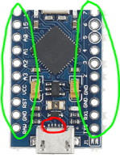
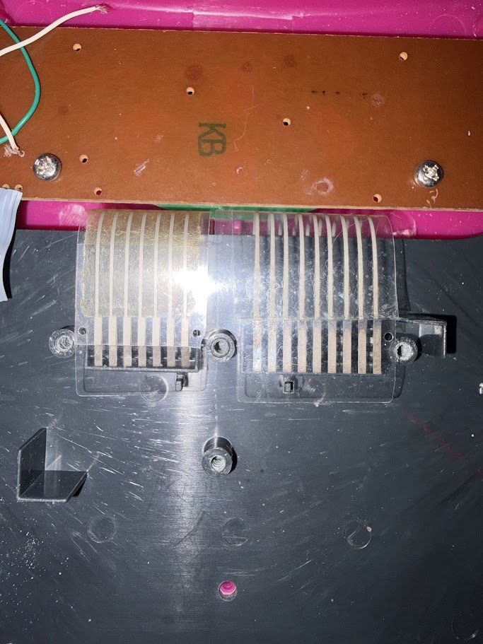
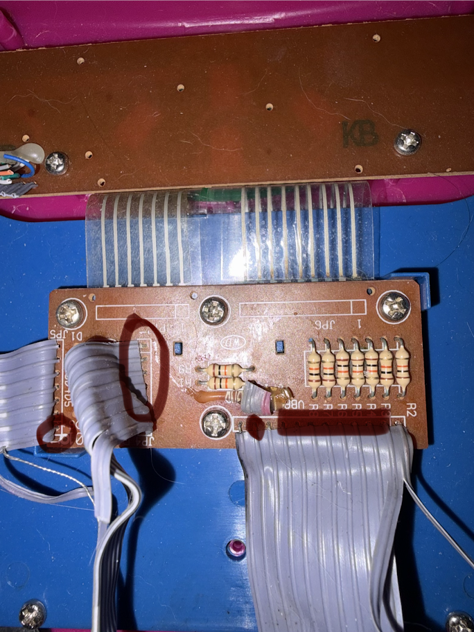

# Como transformei o Laptop da Xuxa em um Cyberdeck

## 1. A ideia

A ideia surgiu quando comecei a postar vídeos sobre cyberdeck, e a sugestão que mais aparecia era o laptop da xuxa.

Quando consegui o laptop, a ideia inicial era substituir o teclado por outro e usar apenas a carcaça. Mas ao desmontar o brinquedo, percebi que o teclado era de membrana e eu poderia reaproveitar o teclado original em vez de colocar um teclado novo.

A ideia era adaptar esse teclado usando um **Arduino Pro Micro**, colocar um **Raspberry Pi** para ser o computador e adaptar a tela com uma tela compatível com o Raspberry Pi.

A lógica ficou basicamente assim:

**Teclado original → Arduino Pro Micro → Raspberry Pi → Tela**

O Arduino interpreta o teclado e faz o Raspberry Pi enxergar como um teclado USB normal.

### Itens usados

* Laptop da Xuxa
* Arduino Pro Micro (ATmega32U4)
* Raspberry Pi
* Tela compatível com o Raspberry Pi
* Cartão microSD
* Adaptador de microSD para USB
* Multímetro
* Ferro de solda
* Estanho para solda
* Fios para as conexões
* Microretífica ou outra ferramenta para cortar a carcaça
* Computador
* Cabo USB para conectar e programar o Arduino

---

## 2. Entendendo o teclado de membrana

Mesmo sendo super possível, a parte do teclado dá um trabalhinho.

O teclado de membrana funciona como uma **matriz de linhas e colunas**. Cada tecla corresponde a uma combinação única entre uma linha e uma coluna.

**Linha 1 + Coluna 5 = tecla 1**

Teclado Matricial 4x3 - Membrana

Meu objetivo era conectar cada linha e cada coluna aos **GPIOs do Arduino Pro Micro**. (que são esses pininhos circulados na foto abaixo)

Assim, quando uma tecla fosse pressionada, o Arduino conseguiria identificar quais conexões foram acionadas.

---

## 3. Como conectar o teclado do laptop em um arduino?

O teclado do Laptop da Xuxa possui uma membrana que termina em um **cabo flat**. Esse cabo encosta em uma plaquinha, de onde saem várias conexões.

Esse é o cabo flat com as conexões:

Para isso, desparafusei a plaquinha e segui visualmente as trilhas para descobrir onde cada uma delas chegava.

Depois, confirmei as conexões usando um **multímetro** no modo de continuidade.

Com isso, descobri quais fios correspondiam às linhas e colunas da matriz e soldei essas conexões nos GPIOs do Arduino Pro Micro.

No caso do Laptop da Xuxa, essas são as conexões utilizadas (preenchi as conexoes que usei)

---

## 4. Descobrindo o que cada tecla fazia

Com tudo conectado, liguei o Arduino ao meu PC.

Usando o software do Arduino, fiz um código para monitorar os GPIOs.

Assim, sempre que eu apertava uma tecla do Laptop da Xuxa, o Arduino mostrava **quais portas do GPIO tinham sido ativadas**.

https://github.com/gio-yaml/Mapeador-de-Matriz-de-Teclado

Deixo aqui o repositório caso você queira fazer algo parecido. No README também deixei o passo a passo.

Fui fazendo isso tecla por tecla e montei uma lista:

Q = porta x e y
W = porta x e y
E = porta x e y

Essa lista virou o mapa do teclado.

---

## 5. Criando o firmware

Depois de descobrir todas as combinações, usei essa lista para programar o firmware do Arduino.

O código basicamente diz:

> “Se essa combinação de GPIOs acontecer, significa que a tecla X foi pressionada.”

O Pro Micro então envia essa informação para o computador através do USB reconhece um teclado comum.

**O código completo que usei no para o firmware está disponível no repositório.**

---

## 6. Instalando o Raspberry Pi OS

Com o teclado resolvido, preparei o Raspberry Pi.

Para isso, usei um cartão microSD e o software **Raspberry Pi Imager**.

O processo é simples:

1. Instale o Raspberry Pi Imager no computador.
2. Coloque o cartão microSD no PC usando um adaptador
3. Escolha o modelo do Raspberry Pi.
4. Selecione o **Raspberry Pi OS**.
5. Escolha o cartão SD.
6. Grave o sistema.

Depois é só colocar o cartão no Raspberry Pi e ligar.

---

## 7. Adaptando a carcaça

Com a parte eletrônica funcionando, eu adaptei a carcaça para a tela.

Eu precisei **cortar a parte interna da carcaça do Laptop da Xuxa** para criar espaço e encaixar a nova tela.

O ideal é usar uma microretifica para cortar do tamanho da sua tela, mas eu usei faca quente pq não tinha disco de corte kkkkk

---

## 8. Montando tudo

Por fim, conectei:

* o teclado ao Arduino Pro Micro;
* o Arduino ao Raspberry Pi;
* a tela ao Raspberry Pi;
* e organizei os componentes dentro da carcaça.

Se você quiser ver o passo-a-passo em vídeo, eu disponibilizei no meu [Canal do Youtube](https://www.youtube.com/@GioYaml)

Caso queira acompanhar projetos como esse nas minhas redes:

[Instagram](instagram.com/gio.yaml/)

 

[Tiktok](https://www.tiktok.com/@gio.yaml)